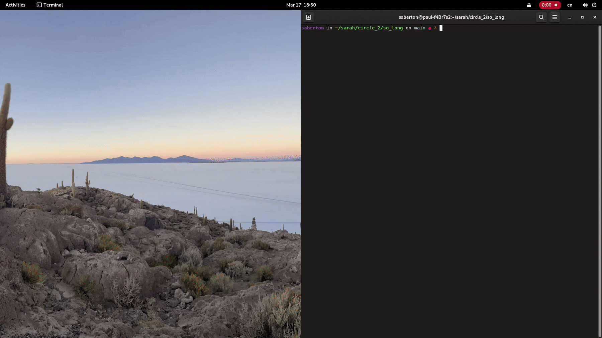
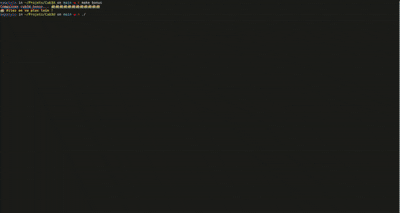
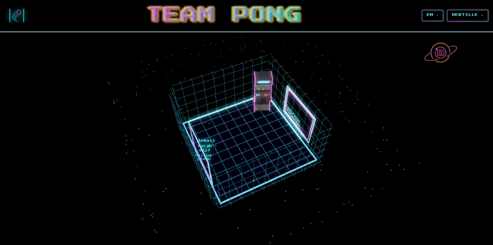

<!-- 
 -->
<!--    -->
<!-- 
 -->
  

---

  

---

  

<table width="100%">
  <tr>
    <td align="left" width="30%">
      

        
      

    </td>
    <td align="right" width="70%">
      

        
        
        </a>
        
        </a>
        
        </a>
        
        
        
        
        
        
        
        
        
      

    </td>
  </tr>
  <tr>
    <td align="left" width="30%">
      

        
      

    </td>
    <td align="right" width="70%">
      

        
        
      

    </td>
  </tr>
  <tr>
    <td align="left" width="30%">
      

        
      

    </td>
    <td align="right" width="70%">
      

        
      

    </td>
  </tr>
    <td align="left" width="30%">
      

        
      

    </td>
    <td align="right" width="70%">
      

        
      

    </td>
  </tr>
  </tr>
    <td align="left" width="30%">
      

        
      

    </td>
    <td align="right" width="70%">
      

        
        
        
        
        
        
        
      

    </td>
  </tr>
</table>

---

  

<table width="100%">
  <tr>
    <td align="left" width="50%">
      

        
      

    </td>
    <td align="right" width="50%">
      

        
      

    </td>
  </tr>
  <tr>
    <td align="left" width="50%">
      

        
      

    </td>
    <td align="right" width="50%">
      

        
      

    </td>
  </tr>
</table>

---

  

<table width="100%">
  <tr>
    <td align="left" width="50%">
      

    </td>
    <td align="right" width="50%">
      

    </td>
  </tr>
  <tr>
    <td align="left" width="50%">
      

    </td>
    <td align="right" width="50%">
      

    </td>
  </tr>
</table>

---

  

  
&nbsp;&nbsp;&nbsp;&nbsp;&nbsp;&nbsp;&nbsp;&nbsp;&nbsp;&nbsp;&nbsp;&nbsp;&nbsp;&nbsp;&nbsp;&nbsp;&nbsp;&nbsp;&nbsp;&nbsp;&nbsp;&nbsp;&nbsp;&nbsp;&nbsp;&nbsp;&nbsp;&nbsp;&nbsp;&nbsp;&nbsp;&nbsp;&nbsp;&nbsp;&nbsp;&nbsp;&nbsp;&nbsp;&nbsp;&nbsp;&nbsp;&nbsp;&nbsp;&nbsp;
  

  
  &nbsp;
  

  

  

---

  

  
  

  

